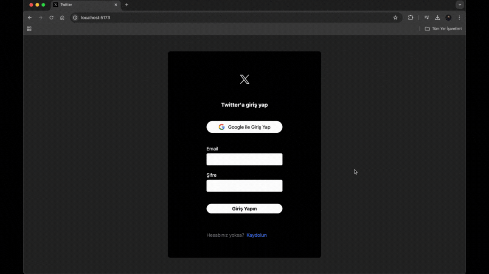

# Twitter Clone

This project is a social media application clone developed using React and Vite. Users can sign up with their email or log in directly with their Google account. The authentication and data management processes are handled using Firebase.

## Technologies and Libraries Used

- React
- Firebase
- Axios
- React Router DOM
- Moment.js
- React Icons
- React Toastify
- UUID

## Project Overview

- **User Sessions**: Managed securely using Firebase Authentication. Users can create accounts, log in, and update their profile information.
- **Tweet Functionality**: Users can post tweet-like entries, like and comment on posts, and update or delete their own tweets.
- **Timestamps**: The date and time for posts and comments are processed using Moment.js and displayed in the user interface.
- **Security and Redirection**: When a user logs out, they are redirected to the login page for security purposes, exiting the main page.
- **Notifications**: Success messages and other notifications are provided using React Toastify.
- **Icons**: The interface uses React Icons for various icons to enhance the design.
- **Trending Topics**: The trending topics displayed on the right are fetched from the Twitter API using Axios, and the user's feed is populated with these API calls.

## GIF

